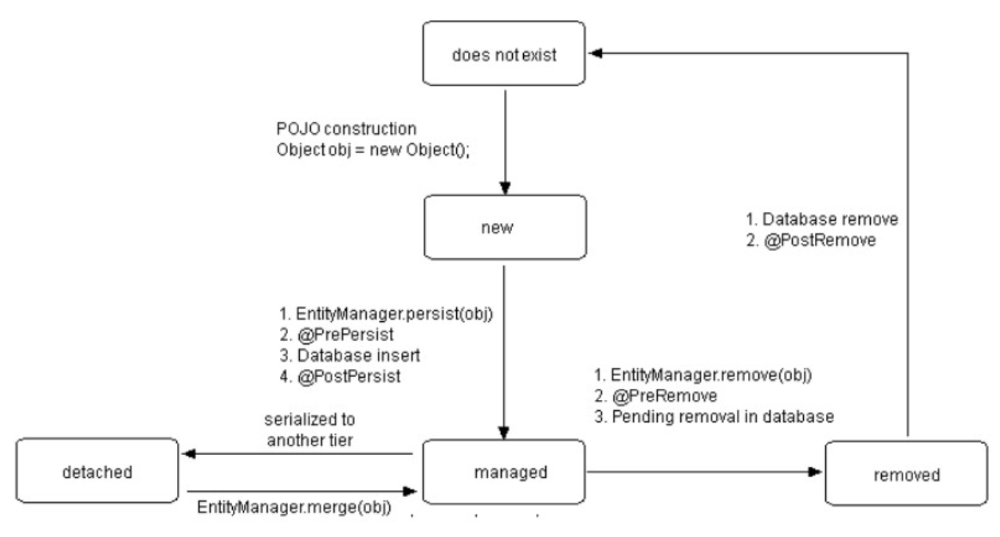
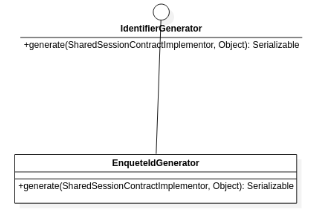
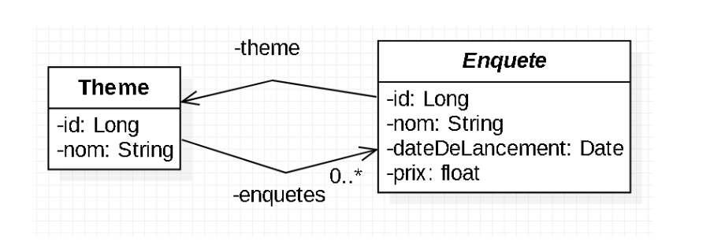
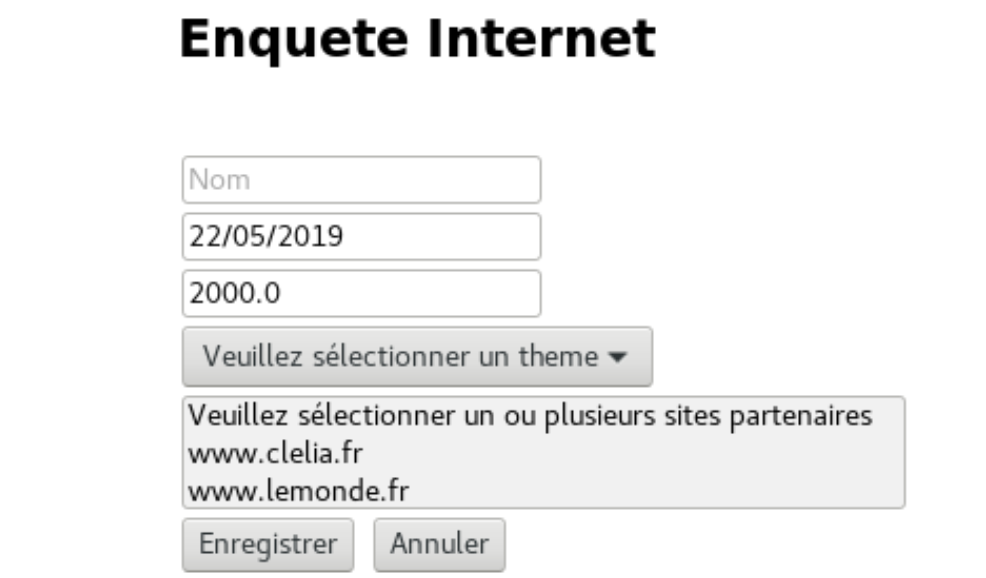
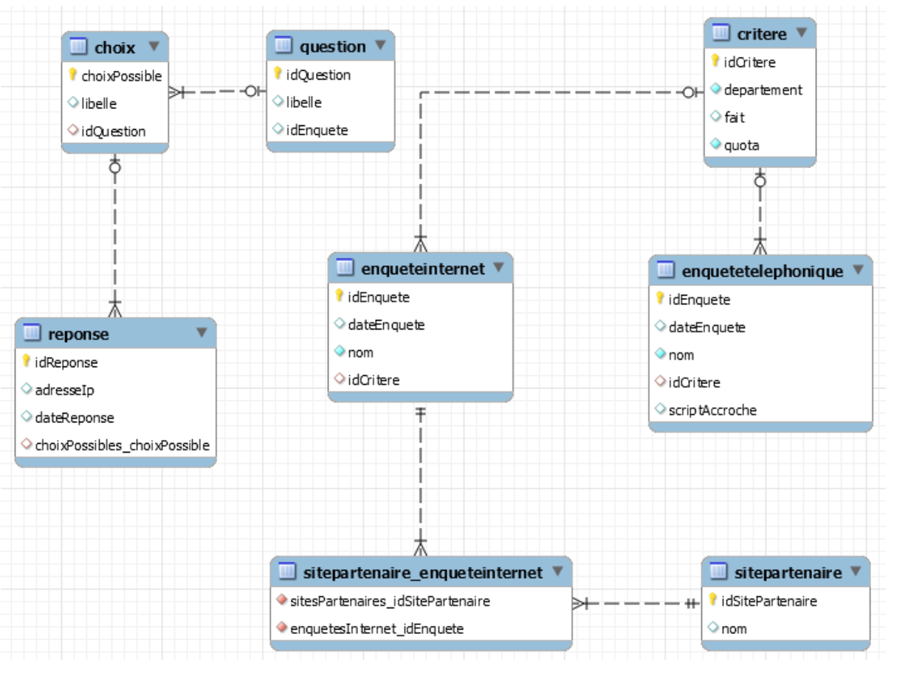
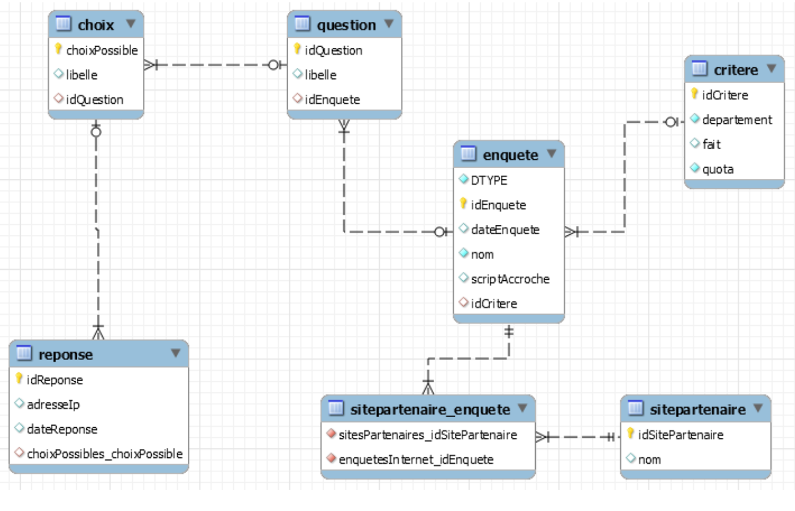
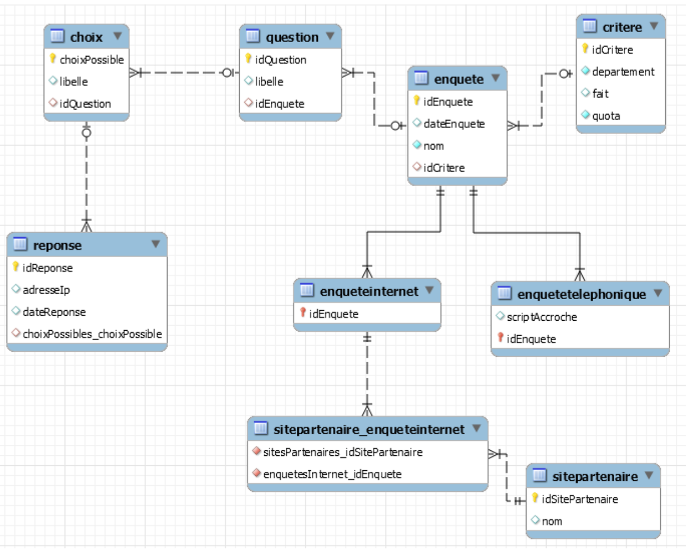

# JPA, Hibernate ORM

( à utiliser dans les classes métier en important les annotations du package javax.persistence)

## @Entity

Définit une classe POJO (Plain Old Java Object) persistante

```java
    @Entity
public class Theme {

@Id
private Long id;

private String nom;
}
```

Chaque objet de type Theme aura une correspondance avec un enregistrement de la table Theme.
En oubliant cette annotation sur une classe métier on obtient une exception
`IllegalArgumentException` :Not a managed type: class
fr.clelia.fx.enquetes.business.Theme
Les entités JPA ont un cycle de vie présenté sur le diagramme suivant :


_Source: Oracle_

## @Id

Précise que l'attribut annoté va donner lieu à une colonne qui sera la clé primaire de la table associée

```java
@Id
private Long id;
```

## @Table

Définit le nom de la table associée à la classe POJO persistante

```java
@Entity
@Table(name = "utilisateurs") public class Utilisateur {}
```

## @Index

Ajoute un index sur la ou les colonnes précisées en paramètre. Cette annotation s’utilise en association avec l’annotation `@Table`

```java
    @Entity
@Table(name = "utilisateurs", indexes = {@Index(columnList = "nom", name = "idx_nom", unique = false)})
public class Utilisateur {}
```

## @Embeddable

Annote une classe qui pourra représenter une clé composite

```java
    @Embeddable
public class Connexion {
    private String login;
    private LocalDateTime dateHeureConnexion;
    }
```

## @EmbeddedId

Définit un id dont le type est une classe annotée `@Embeddable`

```java
@Entity
public class NotificationConnexion {

    @EmbeddedId
    private Connexion connexion;

    private String message;
}
```

## @GeneratedValue

Demande à JPA de choisir une valeur unique pour chaque enregistrement. Il est possible de préciser une stratégie de génération de l’id grâce à un attribut `strategy`.

```java
@Id
@GeneratedValue(strategy=GenerationType.IDENTITY)
private Long id;
```

`strategy=GenerationType.IDENTITY` : utilise une identité propre au SGBD (auto_increment de MySQL, séquence d'Oracle)
`strategy=GenerationType.SEQUENCE` : La génération de la clé primaire se base sur une séquence
`strategy=GenerationType.TABLE` : La génération de la clé primaire utilise des valeurs stockées dans une table qui se nomme par défaut hibernate_sequences
`strategy=GenerationType.AUTO` (valeur par défaut) : laisse Hibernate choisir la stratégie de génération d’id la plus adéquate

## @SequenceGenerator

Déclare la séquence que JPA devra utiliser pour attribuer un id à une nouvelle instance

```java
@Id
@GeneratedValue(strategy=GenerationType.SEQUENCE, generator="utilisateur_sequence")
@SequenceGenerator(name="utilisateur_sequence") private Long id;
```

## @TableGenerator

Déclare la table que JPA devra utiliser pour attribuer un id à une nouvelle instance

```java
@Id
@GeneratedValue(strategy=GenerationType.TABLE, generator="utilisateur_id_broker")
@TableGenerator(name="utilisateur_id_broker", valueColumnName="next_id") private Long id;
```

## @GenericGenerator

Sollicite une classe qui implémente l’interface IdentifierGenerator pour choisir un id unique :

```java
    @Id
    @GeneratedValue(generator="enquete_id_generator")
    @GenericGenerator(name="enquete_id_generator",
    strategy="fr.clelia.fx.enquetes.util.EnqueteIdGenerator")
    private Long id;
```



## @Column

Détaille la manière de créer la colonne en base
Les principaux attributs de l'annotation `@Column` sont :

- `name` : nom de la colonne dans la table associée
- `nullable` : permet d'autoriser ou d'interdire null dans la colonne, pour autoriser null : `nullable=true - unique` : ajoute une contrainte d'unicité sur la colonne
- `length` : précise la longueur de la colonne (pour les attributs de type String), par défaut : `255`
- `updatable` : permet d’autoriser ou d’interdire la mise à jour de la colonne

```java
    @Column(unique=true, nullable=false, length=150)
    private String nom;
```

## @Basic

Déclare de la manière la plus simple une correspondance entre un attribut Java et une colonne éponyme dans la table associée.
Cette annotation est rarement utilisée aujourd’hui. C’est la pièce de musée de ce mémento.

```java
@Basic
private String libelle;
```

## @Lob

Indique que la colonne doit contenir un texte long (permet aussi de stocker des données binaires)

```java
@Lob
private String scriptDAccroche;
```

## @Temporal

`@Temporal(TemporalType.DATE)` : crée dans la table une colonne de type date `@Temporal(TemporalType.TIME)` : crée dans la table une colonne de type time `@Temporal(TemporalType.TIMESTAMP)` : crée dans la table une colonne de type datetime
Important :

- il est conseillé d’utiliser les classes LocalDate, LocalTime et LocalDateTime. En utilisant ces classes l’annotation Temporal n’a pas d’utilité
- il ne faut pas utiliser la classe java.sql.Date dans les classes métier
  Sans préciser `@Temporal`, Hibernate ajoute une colonne datetime pour un attribut de type `java.util.Date`

```java
@Temporal(TemporalType.DATE)
private Date dateDInscription;
```

## @OneToOne

Indique une bijection avec l'autre classe. Entre les deux classes il y a deux associations dirigées (allant dans des directions oposées) avec une multiplicité 0..1 pour chaque association. Exemple : un utilisateur a un seul avatar. Un avatar correspond à un seul utilisateur

```java
@Entity
public class Utilisateur {
@Id
@GeneratedValue
private Long id;
// Autres attributs
@OneToOne
private Avatar avatar; }
```

## @ManyToOne

Indique que plusieurs objets de la classe vont être associés à un seul et même objet de l'autre classe

Dans notre exemple plusieurs enquêtes font référence à un même thème.



```java
@Entity
public abstract class Enquete {
@Id
@GeneratedValue(strategy=GenerationType.IDENTITY)
private Long id;

@Column(unique=true, nullable=false, length=150)
private String nom;

private Date dateDeLancement;

private float prix;

@ManyToOne
private Theme theme; }
```

En base, dans la table Enquete, une colonne theme_id sera ajoutée, c’est une clé étrangère vers la
table Theme.
En oubliant l’annotation `@ManyToOne` sur un attribut métier, on obtient l’erreur suivante :
Caused by: org.hibernate.MappingException: Could not determine type
for: fr.clelia.fx.enquetes.business.Theme, at table: Enquete, for
columns: [org.hibernate.mapping.Column(theme)]

## @OneToMany

Indique qu'un objet de la classe va être associé à plusieurs objets de l'autre classe. Pour l’attribut `mappedBy`, on précise le nom de l’objet dans l’autre classe.
Dans l’exemple de la page précédente: à un thème correspond une liste d’enquêtes. Une enquête est associée à un thème, il y a donc un attribut nommé theme dans la classe Enquete. C’est le nom de cet attribut Java que l’on écrit dans l’attribut `mappedBy` de l’annotation `OneToMany`:

```java
    @Entity
    public class Theme {
    @Id
    @GeneratedValue private
    Long id;
    // Autres attributs
    @OneToMany(mappedBy="theme")
    private List<Enquete> enquetes;
    }
```

En règle générale, dès qu’une classe comporte une liste d’objets métier, elle sera annotée `@OneToMany`. Idem pour un objet de type `Set`.
Bien penser à préciser le type de récupération en utilisant l’attribut `fetch`, par défaut le fetch est `FetchType.LAZY.`

**Exemple**: si l’on souhaite récupérer d’emblée toutes les enquêtes d’un thème, on choisira le type de fetch `EAGER`:

```java
    @OneToMany(mappedBy="theme", fetch=FetchType.EAGER)
    private List<Enquete> enquetes;
```

En essayant de récupérer les enquêtes sans avoir au préalable utilisé le fetch type `EAGER` on obtient l’exception suivante:
Caused by: org.hibernate.LazyInitializationException: failed to lazily initialize a collection of role: fr.clelia.fx.enquetes.business.Theme.enquetes, could not initialize proxy - no Session

:::info

A noter: on ne peut pas avoir plus d’un `FetchType à EAGER` par classe. En utilisant deux fois le `FecthType EAGER` dans une même classe on obtient l’exception suivante:
Caused by: org.hibernate.loader.MultipleBagFetchException: cannot simultaneously fetch multiple bags

:::
Notion de cascade :

- On ajoute en mémoire un objet de type Enquete et on lui associe un ensemble de questions :

  ```java
  Enquete enquete1 = new Enquete(“Enquete 1”, theme1);
  enquete1.getQuestions().add(new Question(“Question 1”, enquete1));
  enquete1.getQuestions().add(new Question(“Question 2”, enquete1));
  ```

  Pour qu’Hibernate enregistre l’enquete en base ainsi que toutes ses questions, il faut définir la liste de questions comme suit :

```java
    @OneToMany(mappedBy="enquete", cascade = CascadeType.PERSIST)
    private List<Question> questions;
```

- Pour que les objets questions soit mis à jour en base (lorsqu’ils évoluent en mémoire), il faut utiliser la valeur `CascadeType.MERGE`

```java
    @OneToMany(mappedBy="enquete", cascade = CascadeType.MERGE)
    private List<Question> questions;
```

- Pour effacer automatiquement tous les questions associées à une enquête qui doit être effacée, l’attribut cascade avec la valeur `CascadeType.REMOVE` doit être précisé:

```java
@OneToMany(mappedBy="enquete", cascade = CascadeType.REMOVE)
private List<Question> enquetes;
```

- Pour effacer automatiquement tous les questions associées à une enquête qui doit être effacée et les détacher de l’entity manager, l’attribut cascade avec la valeur `CascadeType.DETACH` doit être précisé:

```java
@OneToMany(mappedBy="enquete", cascade = CascadeType.DETACH)
private List<Question> enquetes;
```

- Pour garantir toutes les opérations présentées ci-dessus, l’attribut cascade doit avoir la valeur `CascadeType.ALL`

```java
@OneToMany(mappedBy="enquete", cascade = CascadeType.ALL)
private List<Question> questions;
```

## @ManyToMany

Indique une liste dans chaque classe. Entre les deux classes il y a deux associations dirigées (allant dans des directions oposées) avec une multiplicité 0..\* pour chaque association.

Exemple : à une enquête correspond plusieurs sites internet. Un site internet est utilisé par plusieurs enquête.
En base une table de mapping sera créée.

L’attribut `mappedBy` doit figurer uniquement sur une des deux annotations sinon l’exception `AnnotationException` est levée avec le message suivant: Illegal use of mappedBy on both sides of the relationship
On choisit de mettre l’attribut `mappedBy` sur la classe satellite, dans ce projet la classe centrale est
Enquete, les classes autour sont les classes satellites.

Dans l’exemple ci-dessous, l’enregistrement d’un objet de type Enquete “alimentera” bien la table de mapping car dans la classe SitePartenaire on a le code suivant:

```java
@ManyToMany(mappedBy="sitesPartenaires")
private Set<EnqueteInternet> enquetes;
```

Hibernate va remplir la liste sitesPartenaires avec ce qui a été choisi dans la liste multiple (select)



## @JoinColumn

Redéfinit la colonne sur laquelle il existe une contrainte de clé étrangère

```java
@ManyToOne
@JoinColumn(name = "idEnquete")
private Enquete enquete;
```

## @JoinTable

Renomme la table de mapping (créée par un ManyToMany)

```java
 @ManyToMany
 @JoinTable(name = "enquetesInternet_SitesPartenaires")
 private List<SiteParteneraire> sitesPartenaires;
```

## @Inheritance

La classe Enquete est la classe mère des classes EnqueteTelephonique et EnqueteInternet. L’annotation `@Inheritance` permet de préciser la stratégie dans la manière de créer les tables liées à la notion d'héritage

- `strategy=InheritanceType.TABLE_PER_CLASS` : duplique les données pour éviter les opérations de jointure



:::info

NB : en choisissant cette stratégie d’héritage, la stratégie de génération de l’id dans la classe mère Enquete ne peut pas être IDENTITY. Il faudra choisir entre `AUTO`, `SEQUENCE` et `TABLE`.

:::

- `strategy=InheritanceType.SINGLE_TABLE` : classe mère et classes filles sont représentées par une table unique.
  La colonne `DTYPE` contiendra en toutes lettres le nom de la classe fille dont l’objet est une instance. Dans notre exemple : EnqueteTelephonique ou EnqueteInternet

  

La table Enquete va contenir des enregistrements correspondants à des enquêtes téléphoniques et des enregistrements correspondants à des enquêtes Internet

- `strategy=InheritanceType.JOINED` : classe mère et classes filles sont représentées chacune par une table.



Dans la table représentant la classe mère, on trouvera les attributs communs à toutes les classes filles. Dans la table représentant la classe fille, on trouvera les informations propres à la classe fille.
Si la stratégie n’est pas précisée, la stratégie `SINGLE_TABLE` est utilisée. L’annotation `@Inheritance` se place sur la classe mère.

```java
@Entity
@Inheritance(strategy=InheritanceType.SINGLE_TABLE)
public abstract class Enquete {}
```

La classe fille EnqueteTelephonique est déclare ainsi:

```java
@Entity
public class EnqueteTelephonique extends Enquete {}
```

## @DiscriminatorValue

Cette annotation sert uniquement dans les classes filles et avec la stratégie d’héritage `SINGLE_TABLE`. Elle permet de redéfinir la valeur qui sera ajoutée dans la colonne discriminante (par défaut nommée `DTYPE`)

## @DiscriminatorColumn

Définit le nom de la colonne discriminante dans la table représentant la classe mère. En l’absence de cette annotation, la colonne discriminante se nomme `DTYPE`.
Cette annotation sert uniquement lorsque la stratégie d’héritage est `SINGLE_TABLE`.

```java
@Entity
@Inheritance(strategy=InheritanceType.SINGLE_TABLE)
@DiscriminatorColumn(name="TypeEnquete")
public abstract class Enquete {}
```

## @MappedSuperClass

Cette annotation s’utilise sur une classe mère abstraite. Cette classe mère abstraite ne pourra pas être référencée dans des entités avec les relations `@ManyToOne`, `@ManyToMany` ou `@OneToOne`.
Elle remplace l’annotation `@Entity`.
Les attributs de la classe annotée `@MappedSuperClass` seront propagés dans les classes filles.

```java
@MappedSuperClass
public abstract class Enquete {}
```

## @NamedQuery

Déclare une requête HQL qui sera accessible par toutes les classes du projet

```java
@Entity
@NamedQuery(name="Joueur.findAll", query="SELECT j FROM Joueur j")
public class Joueur {}
```

## @Cache

Hibernate met en cache des objets dans chaque session. Chaque session constitue un cache de premier niveau. L’annotation `@Cache` configure l’entité dans le cache de second niveau.
Cette configuration utilise l’énumération `CacheConcurrencyStrategy` qui met à disposition cinq stratégies : `NONE`, `READ_ONLY`, `NONSTRICT_READ_WRITE`, `READ_WRITE` et `TRANSACTIONAL`.

```java
@Entity
@Cache(usage=CacheConcurrencyStrategy.READ_WRITE)
public class Theme {}
```

## @ForeignKey

La particularité de cette annotation vient du fait qu’elle ne peut annoter un élément Java comme une classe, une méthode ou un attribut car sa cible est définie comme suit :

```java
@Target({})
 @Retention(RetentionPolicy.RUNTIME)
 public @interface ForeignKey {}
```

De ce fait, elle peut seulement être utilisée dans le paramètre d’une annotation, exemple :

```java
@ManyToOne
@JoinColumn(foreignKey=@ForeignKey(name="fk_theme"))
private Theme theme;
```

## @Transient

Permet de définir un attribut dans la classe sans qu’une colonne soit ajoutée dans la table associée. Dans l’exemple ci-dessous Hibernate ne va pas créer une colonne prixTTC dans la table associée à l’entité JPA :

```java
@Transient
private float prixTTC;
```

## @Fetch

Demande à Hibernate d’alimenter automatiquement les listes d’objets. Il existe trois modes de récupération : `JOIN`, `SELECT` et `SUBSELECT`

```java
@Fetch(value = FetchMode.SELECT)
@ManyToMany
private List<Question> questions;
```
