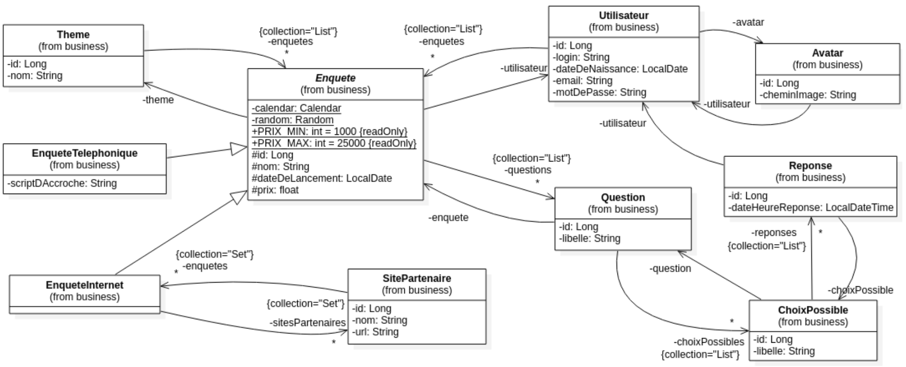

# Introduction

Pour ce mémento on considère une application Web de gestion d’enquêtes dont voici le diagramme de classes métier :



Les annotations donnent des consignes au programme, au compilateur ou à l’outil qui génère la documentation. Ces consignes sont qualifiées de métadonnées. Elles font leur apparition avec la version 5 du JDK sortie en 2004. À cette époque, dans le package java.lang, elles sont au nombre de quatre et sont encore utilisées aujourd’hui : `@Override`, `@Deprecated`, `@SuppressWarnings` et `@SafeVarargs` https://docs.oracle.com/en/java/javase/20/docs/api/java.base/java/lang/Override.html

Une annotation est définie par Oracle comme un type spécial d’interface :
https://docs.oracle.com/javase/specs/jls/se18/html/jls-9.html#jls-9.6

Elle se déclare en utilisant l’écriture `@interface` :

```java
public @interface MonAnnotation {}
```

Avec la version 6 du JDK sortie en 2006, Sun enrichit l’ensemble des annotations en proposant les common annotations (notamment
`@Resource` et `@PostConstruct`) regroupées dans les package javax.annotation (Java SE) et javax.annotation.security (Java EE).

Avec la version 8 du JDK sortie en 2014, Oracle ajoute l’annotation `@FunctionalInterface` dans le package `java.lang` pour permettre aux développeurs Java de passer à la programmation fonctionnelle.

On distinguera les annotations dites marqueur (marker annotations) c’est-à-dire sans attribut (exemple : `@Override`), les annotations paramétrées avec une seule valeur (single value annotations) (exemple : `@Max(42)`) et les annotations avec plusieurs paramètres (full annotations) (exemple : `@Range(min=1, max=42)`).

Chaque framework apporte son lot d’annotations, il en va de même pour les bibliothèques.

Ce mémento, débuté en 2015, a pour objectif de présenter quelques annotations à connaître dans chaque framework/bibliothèque. Il n’a pas pour objectif d’être exhaustif.

Pour aller plus loin sur le concept d’annotation, je vous invite à consulter le lien suivant :
https://www.jmdoudoux.fr/java/dej/chap-annotations.htm
