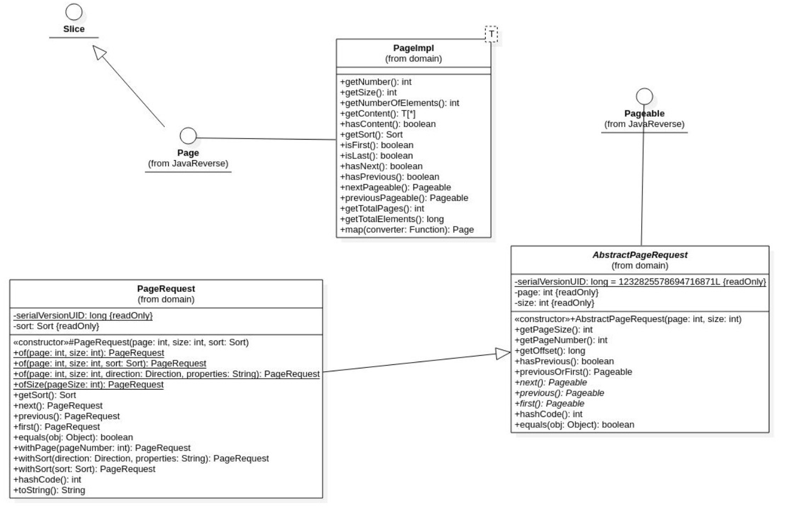
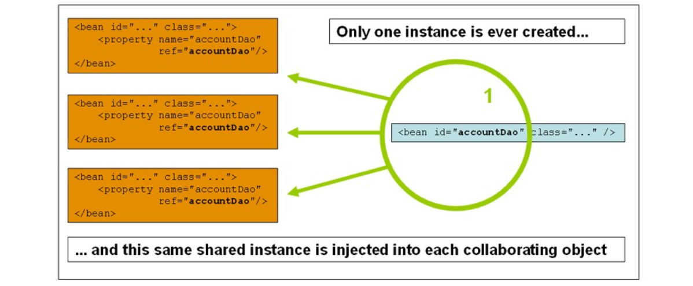
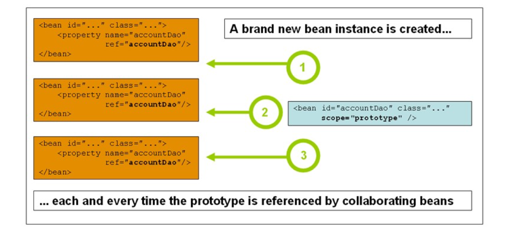

# Spring

## @Autowired

Demande à Spring d'injecter une dépendance dans l'objet de la classe considérée. Exemple : demande d’injection de la dépendance enqueteDao dans une classe de service :

```java
@Autowired
private final EnqueteDao enqueteDao;
```

Cette annotation est de moins en moins utilisée car la communauté Spring suggère de demander l’injection de dépendances via le constructeur de la classe. En suivant cette recommandation, l’exemple ci-dessus sera ré-écrit :

```java
private final EnqueteDao enqueteDao;

public EnqueteServiceImpl(EnqueteDao enqueteDao) {
    super();
    this.enqueteDao = enqueteDao;
    }
```

## @Component

Laisse à Spring la responsabilité de déterminer le stéréotype ou le rôle de la classe, autrement dit à quelle couche logicielle appartient la classe annotée. Spring va créer une instance de cette classe, instace qu’il va ensuite ajouter dans son conteneur IoC.

Cette annotation fonctionne aussi sur des filtres (classes implémentant l’interface javax.servlet.Filter)

Il existe cinq types de stéréotypes :
https://docs.spring.io/spring-framework/docs/current/javadoc-api/org/springframework/stereotype/package-summary.html

```java
@Component
public class EnqueteServiceImpl implements EnqueteService {}
```

## @Controller

Déclare une classe qui va traiter les requêtes HTTP. Cette classe est considérée comme le contrôleur dans l’architecture MVC

```java
@Controller
public class EnqueteController {}
```

## @RestController

Déclare une classe qui va traiter des requêtes HTTP dans une API REST

```java
@RestController
public class EnqueteControllerWS {}
```

## @Service

Déclare une classe de service

```java
@Service
public class EnqueteServiceImpl implements EnqueteService {}
```

En oubliant l’annotation `@Service` sur la classe de service on obtient l’erreur :
Parameter 2 of constructor in fr.clelia.fx.enquetes.controller.EnqueteController required a bean of type 'fr.clelia.fx.enquetes.service.EnqueteService' that could
not be found.

## @Repository

Déclare une classe DAO (Data Access Object : classe capable de communiquer avec la base de données)

```java
@Repository
public class JoueurDaoImpl implements JoueurDao {}
```

Grâce à Spring Data, cette annotation n’est quasiment plus utilisée car pour mettre en œuvre une DAO il suffit de déclarer une interface qui hérite de `JpaRepository`, `PagingAndSortingRepository` ou `CrudRepository`

Spring Data implémente les DAO à notre place, voir la classe SimpleJpaRepository :

https://github.com/spring-projects/spring-data-jpa/blob/main/src/main/java/org/springframework/data/jpa/repository/support/SimpleJpaRepository.java

## @Query

Déclare la requête HQL associée à la méthode de l’interface DAO

```java
@Query("FROM Theme t ORDER BY size(t.enquetes) DESC")
List<Theme> findThemesSortedByNbEnquetes();
```

Il est possible de fournir une requête SQL native en utilisant l’attribut `nativeQuery=true`

A noter: sans l’annotation `@Query`, Spring Data génère à la volée une requête HQL en analysant le nom de la méthode (on parle alors de requête par dérivation) :

https://docs.spring.io/spring-data/jpa/docs/current/reference/html/
#jpa.query-methods.query-creation

Pour résumer, on peut déclarer des méthodes dans une interface DAO de trois manières différentes :

```java
// Méthode annotée avec @Query portant une requête HQL
@Query("FROM Theme ORDER BY id DESC")
List<Theme> findThemes();
// Méthode annotée avec @Query portant une requête SQL native
@Query(value="SELECT id, nom FROM theme ORDER BY id DESC", nativeQuery=true)
List<Theme> findThemes2();
// Méthode dont le nom sera traduit par Spring Data pour produire une requête HQL
// Cette requête HQL sera transmise à Hibernate qui la traduira en requête SQL
List<Theme> findByNomContainingOrderByIdDesc(String nom);
```

## @Param

Déclare les paramètres de la méthode Java devant être utilisés comme des paramètres HQL

```java
@Query("FROM Question WHERE enquete.id=:eid")
public List<Question> findByIdEnquete(@Param("eid") Long idEnquete);
```

## @Modifying

Annote une méthode d’une interface de la DAO qui exécute une requête de type `INSERT`, `UPDATE` ou `DELETE`

```java
@Modifying
@Transactional
@Query("UPDATE Enquete SET nom=upper(nom)")
void updateNomEnquetes();
```

## @Transactional

Définit un contexte transactionnel (typiquement sur les méthodes des classes de service ou sur la classe de service)
Si une annotation `@Transactional` est présente sur la classe et sur une méthode, c’est l’annotation sur la méthode qui l’emporte.

Pour définir une transaction en lecture seule (ce qui est très fréquent pour les méthodes de récupération dans les classes de services) : `@Transactional(readOnly = true)`
La transaction a une propagation qui par défaut a la valeur `REQUIRED`. Avec cette valeur, Spring

teste s’il y a une transaction en cours et propage des changements dans cette transaction active. S’il n’y a pas de connexion active, Spring crée une nouvelle transaction.

Source : https://docs.spring.io/spring-framework/docs/5.3.9/reference/html/data-access.html#tx-propagation

Voici trois ressources détaillant les différents types de propagation et d’isolation :

https://link.springer.com/content/pdf/bbm:978-1-4842-5626-8/1

https://www.baeldung.com/spring-transactional-propagation-isolation

https://www.baeldung.com/transaction-configuration-with-jpa-and-spring

```java
@Service
@Transactional
public class EnqueteServiceImpl implements EnqueteService {}
```

## @RequestMapping

Définit une correspondance entre une (ou plusieurs) URL et une méthode du contrôleur. En d’autres termes, cette annotation déclare la correspondance entre une méthode du contrôleur et la ou les URL qu’elle prend en charge

```java
@RequestMapping(value = { "index", "/"}, method = RequestMethod.GET )
public ModelAndView accueil() {}
```

## @RequestParam

Indique que le paramètre de la méthode (du contrôleur) provient de l'objet request.
En d’autres termes, on demande à Spring de lire un paramètre présent dans la requête HTTP.

Spring convertira l'objet dans le type attendu.

**Exemple 1 : Lecture des données dans l’URL**

On souhaite lire le paramètre ID fourni dans l’URL suivante : http://localhost:8080/enquete?ID=2

Pour cela il faut déclarer un paramètre annoté `@RequestParam` comme suit :

```java
@RequestMapping(value="enquete", method = RequestMethod.GET)
public ModelAndView enqueteGet(@RequestParam(name="ID") Long id) {}
```

**Exemple 2 : Lecture des données saisies sur un formulaire HTML**
On considère le formulaire HTML suivant :

```html
<form action="enregistrerQuestion" method="post">
  <input type="text" name="LIBELLE" />
  <input type="hidden" name="ID_ENQUETE" />
  <input type="submit" value="Enregistrer" />
</form>
```

La méthode du contrôleur doit être annotée PostMapping car l’attribut method de la balise form est post.
L’attribut value de l’annotation RequestMapping doit correspondre à la valeur de l’attribut action de la balise form

```java
@RequestMapping(value = "enregistrerQuestion", method = RequestMethod.POST)
public ModelAndView questionPost(@RequestParam(name="ID_ENQUETE") Long idEnquete,
@RequestParam(name="LIBELLE") String libelle) {}
```

Il est possible de rassembler tous les paramètres dans un dictionnaire comme suit :

```java
@RequestMapping(value = { "index", "/"}, method = RequestMethod.GET) public ModelAndView accueil(@RequestParam Map<String, String> map) {}
```

Pour ne pas obliger la présence d’un paramètre (et éviter un code retour 400 si le paramètre est absent), l’attribut required sera affecté à false :

```java
@RequestMapping(value = "question", method = RequestMethod.POST) public ModelAndView questionPost(
@RequestParam(name="ID_ENQUETE") Long idEnquete, @RequestParam(name="LIBELLE", required=false) String libelle) {}
```

Il est possible de donner une valeur par défaut dans le cas où le paramètre n’est pas présent dans la requête HTTP :

```java
@RequestMapping(value = "question", method = RequestMethod.POST) public ModelAndView questionPost(
@RequestParam(name="ID_ENQUETE") Long idEnquete, @RequestParam(name="LIBELLE", required=false, defaultValue="Indéfini") String libelle) {}
```

## @GetMapping

Depuis Spring 4.3 sorti en 2016, définit une correpondance entre une (ou plusieurs) URL et une méthode du contrôleur Spring.
Cette correspondance s’applique uniquement si la méthode HTTP de la requête est `Get`.

L’annotation GetMapping est déclarée ainsi :

```java
@Target(ElementType.METHOD)
@Retention(RetentionPolicy.RUNTIME)
@Documented
@RequestMapping(method=RequestMethod.GET)
public @interface GetMapping {}
```

Voici deux écritures équivalentes :

::: code-group

```java [RequestMapping]
@RequestMapping(value="enquete", method = RequestMethod.GET)
public ModelAndView getEnquete(@RequestParam(name="ID") Long id) {}
```

```java [GetMapping]
@GetMapping("enquete")
public ModelAndView getEnquete(@RequestParam(name="ID") Long id) {}
```

:::

La méthode enqueteGet ci-dessous sera invoquée :

- lorsque l’internaute saisit l’adresse http://localhost/enquetes dans la barre d’adresse de son navigateur internet puis tape Entrée :

- lorsqu’un hyperlien avec un attribut href égal à “http://localhost/enquetes” est cliqué

- ou lorsqu’une requête utilisant la méthode GET vers http://localhost/enquetes est envoyée à partir du front (Angular, React ou Vue), ou de Postman, Hoppscotch ou Insomnia

```java
@GetMapping("enquetes")
public ModelAndView getEnquetes() {}
```

## @PostMapping

Définit une correpondance entre une (ou plusieurs) URL et une méthode du contrôleur Spring. Cette correspondance s’applique uniquement si la méthode de la requête HTTP est Post.

```java
@PostMapping("filtrerLesEnquetes")
public ModelAndView filtrerEnquetes(@RequestParam Map<String, String> map) {}
```

A noter: La méthode ci-dessous est invoquée lorsque le bouton submit du formulaire ci-dessous est cliqué:

```html
<form action="filtrerLesEnquetes" method="post">
  <input type="text" name="NOM" />
  <input type="submit" value="Filtrer" />
</form>
```

## @PutMapping

Définit une correpondance entre une (ou plusieurs) URL et une méthode du contrôleur Spring. Cette correspondance s’applique uniquement si la méthode de la requête HTTP est Put.

```java
@PutMapping(value="mettreAJourEnquete")
public Enquete majEnquete(@RequestBody Enquete enquete) {}
```

## @PatchMapping

Définit une correpondance entre une (ou plusieurs) URL et une méthode du contrôleur Spring. Cette correspondance s’applique uniquement si la méthode de la requête HTTP est Patch.

```java
@PatchMapping(value="mettreAJourPrixEnquete")
public Enquete majPrixEnquete(@RequestParam Map<String, String> map) {}
```

## @DeleteMapping

Définit une correpondance entre une (ou plusieurs) URL et une méthode du contrôleur Spring. Cette correspondance s’applique uniquement si la méthode de la requête HTTP est Delete.

```java
@DeleteMapping(value="supprimerEnquete")
public boolean supprimerEnquetes(@RequestParam Long idEnquete) {}
```

## @CrossOrigin

Autorise une application externe (très souvent le front-end) à envoyer des requêtes HTTP au contrôleur

```java
@Controller
@CrossOrigin(origins = "http://localhost:4200/", maxAge = 3600, methods = {RequestMethod.GET, RequestMethod.POST})
public class EnqueteController {}
```

## @ResponseStatus

Annotation qui impose le code retour de la réponse à une requête HTTP

Il est conseillé d’utiliser l’énumération HttpStatus :
https://docs.spring.io/spring-framework/docs/current/javadoc-api/org/springframework/http/ HttpStatus.html

Exemples de codes retour usuels :
200 OK
201 CREATED
204 NO CONTENT
302 FOUND
400 BAD REQUEST
404 NOT FOUND
409 CONFLICT
422 UNPROCESSABLE ENTITY

La liste complète des codes retour : https://fr.wikipedia.org/wiki/Liste_des_codes_HTTP

Dans l’exemple ci-après, la méthode renvoie un code retour 201 (CREATED) pour confirmer l’ajout de l’enquete via l’API REST :

```java
@ResponseStatus(code=HttpStatus.CREATED)
@PostMapping("enquetes")
public Enquete postEnquete(@RequestBody Enquete enquete) {}
```

## @ExceptionHandler

Annotation à placer au dessus du méthode qui traite une exception “maison”

```java
@ExceptionHandler(fr.clelia.fx.enquetes.exception.ThemeExistantException)
@ResponseStatus(code=HttpStatus.CONFLICT)
public String traiterThemeDejaExistant(Exception exception) {
return exception.getMessage();
}
```

## @ControllerAdvice

Depuis Spring 3.2, annotation à placer au dessus d’une classe qui traite des exceptions communes à tous les contrôleurs de l’application

```java
@ControllerAdvice
public class TraitementGlobalDesExceptions {
@ExceptionHandler(ConstraintViolationException.class)
      ResponseEntity<Object>
      constraintViolationHandlerException(ConstraintViolationException e) {
      final List<String> erreurs = new ArrayList<>();
      e.getConstraintViolations().forEach(violation ->
      erreurs.add(violation.getMessage()));
      return new ResponseEntity<>(erreurs, HttpStatus.BAD_REQUEST); }
}
```

## @RestControllerAdvice

Similaire à `@ControllerAdvice` mais consommé par les contrôleurs annotés `@RestController`

## @ModelAttribute

Annotation utilisée sur un paramètre d'une méthode du contrôleur.

Dans les méthodes annotées `@GetMapping`, elle accompagne un objet d'une classe métier envoyé à une vue :

```java
@GetMapping("inscription")
public ModelAndView getInscription(@ModelAttribute("utilisateur") Utilisateur utilisateur) {
        // Grâce à l’annotation @ModelAttribute, il n’est pas nécessaire d’écrire
mav.addObject(“utilisateur”, utilisateur)) car Spring va envoyer un objet de type
Utilisateur à la vue JSP
return new ModelAndView("inscription");
```

Dans les méthodes annotées `@PostMapping`, elle accompagne un objet métier incorporé dans le
corps de la requête HTTP :

```java
@PostMapping("inscription")
public ModelAndView postInscription(@Valid @ModelAttribute("utilisateur") Utilisateur utilisateur, BindingResult result) {
if (result.hasErrors()) {
// La validation de l’objet utilisateur par rapport aux contraintes // de validation définies dans la classe métier Utilisateur a produit // des erreurs
ModelAndView mav = getInscription(utilisateur);
return mav;
} else { utilisateurService.enregistrerUtilisateur(utilisateur); return new ModelAndView("redirect:merciInscription");
}
}
```

A noter : la vue (la JSP inscription.jsp) doit contenir une balise `form:form` comme suit:

```html
<form:form
  action="inscription"
  method="post"
  modelAttribute="utilisateur"
></form:form>
```

Pour rappel: l’annotation `@Valid` permet de délèguer à Spring le travail de validation sur l’objet annoté. En d’autres termes, toutes les contraintes de validation exprimées dans les classes métier (présentes dans le package business) seront vérifiées par Spring (qui utilise pour ce faire Hibernate validator).

## @SessionAttributes

Demande à Spring de stocker en session les attributs d’un objet envoyé à un formulaire HTML

```java
@Controller
@SessionAttributes("enquete")
public class EnqueteController {}
```

## @Validated

Demande à Spring de valider l’ensemble des paramètres avant l’invocation de la méthode invoquée

```java
@Controller
@Validated
public class EnqueteController {}
```

## @DateTimeFormat (pattern = “dd/MM/yyyy”)

Permet de définir un attribut de type `Date`, `LocalDate`, `LocalTime` ou `LocalDateTime` avec un format précisé en attribut. L’utilisation de cette annotation dispense d’écrire du code dans la méthode annotée initBinder

```java
@DateTimeFormat(pattern = "dd/MM/yyyy")
private Date dateDeLancement;
```

A la place d’un attribut pattern, on peut se reposer sur l’attribut iso qui fera appel à une des valeurs de l’énumération `DataTimeFormat`.ISO :

https://docs.spring.io/spring-framework/docs/current/javadoc-api/org/springframework/format/annotation/DateTimeFormat.ISO.html

```java
@DateTimeFormat(iso = DateTimeFormat.ISO.DATE) LocalDate dateDeNaissance
private LocalDate dateDeNaissance;
```

## @PageableDefault

Définit les paramètres de pagination et de tri par défaut

```java
public ModelAndView enquetesGet(@PageableDefault(size = 10, sort = "dateDeLancement") Pageable pageable) {}
```

::: info

A noter :

- dans les services et les DAO, toutes les méthodes ayant un paramètre de type `Pageable` doivent renvoyer un objet de type `Page`
- l’interface `Pageable` à importer est : org.springframework.data.domain.Pageable

:::



## @SortDefault

Définit les paramètres de tri par défaut

```java
public ModelAndView enquetesGet(@PageableDefault(size = 10) @SortDefault(sort = "dateDeLancement", direction = Sort.Direction.DESC) Pageable pageable) {}
```

## @InitBinder

Annotation d’une méthode “montrant” à Spring comment obtenir un objet métier à partir de son id ou comment transformer un objet en un autre objet. La conversion de données (en anglais binding) est réalisée par Spring grâce aux méthodes annotées `@InitBinder`

```java
@InitBinder
public void initBinder(WebDataBinder binder) {
 // Apprend à Spring à convertir un String en Date
SimpleDateFormat dateFormat = new SimpleDateFormat("yyyy-MM-dd"); dateFormat.setLenient(false);
binder.registerCustomEditor(Date.class, new CustomDateEditor(dateFormat, true));
  // Apprend à Spring à convertir un id de Theme en objet de type Theme
binder.registerCustomEditor(Theme.class, "theme", new PropertyEditorSupport() { @Override
public void setAsText(String id) { setValue((id.equals("")) ? null :
themeService.recupererTheme(Long.parseLong((String) id))); }
});
  // Apprend à Spring à convertir une liste d’id en liste d’intérêts
binder.registerCustomEditor(List.class, "interets", new CustomCollectionEditor(List.class) {
@Override
public Object convertElement(Object objet) { Long id = Long.parseLong((String) objet); return interetService.recupererInteret(id);
} });
}
```

Pour la classe PropertyEditorSupport, se référer à la javadoc : https://docs.oracle.com/en/java/javase/17/docs/api/java.desktop/java/beans/ PropertyEditorSupport.html

L’annotation InitBinder peut accueillir un attribut value dont la valeur contient le nom de l’objet à convertir :

```java
@InitBinder(value="theme.nom")
public void initBinder(WebDataBinder binder) {
  // Apprend à Spring à convertir un nom de Theme en objet de type Theme
binder.registerCustomEditor(Theme.class, new PropertyEditorSupport() { @Override
public void setAsText(String nom) {
setValue((nom.equals("")) ? null : themeService.recupererTheme(nom));
} });
}
```

## @PostConstruct

Annotation sur une méthode que Spring va invoquer juste après avoir instancé la classe et injecté toutes les dépendances dans l’objet instancié

Exemple : la méthode ajouterDonnesInitiales() est présente dans le contrôleur EnqueteController. Une fois que Spring a instancié un objet de cette classe et injecté toutes les dépendances (notamment les services), la méthode ajouterDonneesInitiales() sera invoquée :

```java
@PostConstruct
public void ajouterDonneesInitiales() {}
```

## @PreDestroy

Annotation sur une méthode qui sera invoquée automatiquement juste avant que Spring retire le bean de son contexte applicatif

```java
@PreDestroy
public void retirerDonneesInitiales() {}
```

## @PathVariable

Désigne une variable qui se trouve dans le chemin de l’URL (et non en paramètre (pour rappel les paramètres se trouvent après le point de l’interrogation d’une URL))

Exemple d’URL: http://localhost:8080/enquete/4

Le code ci-dessous récupère l’id de l’enquête à partir de l’URL. (idEnquete aura dans l’URL précédente la valeur 4)

```java
@GetMapping(value="/enquete/{idEnquete}", produces="MediaType.APPLICATION_JSON_VALUE")
public Enquete enqueteGet(@PathVariable Long idEnquete) {}
```

## @Bean

Déclare une méthode dont l’objet retourné sera géré par le conteneur Spring

```java
@Bean
public EmbeddedServletContainerFactory servletContainer() {}
```

## @Scope

Précise la portée du bean. Par défaut Spring crée une seule instance d’un bean (singleton). Pour que Spring crée une nouvelle instance à chaque fois que la méthode est invoquée, il faut utiliser la valeur `@Scope(“prototype”)`

```java

      /**
       * Cette méthode affiche en console tous les objets présents dans le
conteneur Spring
* @param applicationContext
* @return
*/
@Bean
@Scope(ConfigurableBeanFactory.SCOPE_SINGLETON)
public CommandLineRunner commandLineRunner(ApplicationContext
applicationContext) { return args -> {
                  String[] noms = applicationContext.getBeanDefinitionNames();
for (String nom : noms) { System.out.println(nom + " : " +
applicationContext.getBean(nom).getClass().getSimpleName());
                  }
}; }
```

Le schéma ci-après synthétise la portée singleton :



Le schéma ci-après synthétise la portée prototype :



Source : https://docs.spring.io/spring-framework/docs/current/reference/html/core.html

## @Configuration

Déclare une classe de configuration (un objet de cette classe remplace le fichier xml de configuration de Spring (souvent appelé spring-servlet.xml))

```java
@Configuration
public class EnquetesConfiguration {}
```

A noter : les classes de configuration peuvent être remplacées par des lignes dans le fichier texte `src/main/resources/application`.properties systématiquement lu par Spring Boot

## @Value

Utilise la valeur d’une variable définie dans le fichier `src/main/resources/application.properties`:

```java
@Value("${google.client.client-secret}") private String clientSecret;
```

```java
@Value("#{ systemProperties[‘user.region’] }") private String locale;
```

## @RequestBody

Récupère les données dans le corps de la requête HTTP.

NB : l’annotation `@RequestBody` à importer dans ce cas de figure est org.springframework.web.bind.annotation.RequestBody
et non celle de Swagger : io.swagger.v3.oas.annotations.parameters.RequestBody

```java
@PostMapping("/theme")
public Theme postTheme(@RequestBody Theme theme) {
return themeService.enregistrerTheme(theme); }
```

## @ResponseBody

Précise que le retour de la méthode correspond à la réponse qui va être envoyée au client HTTP

```java
@GetMapping(value="/fichierExcel", produces="application/vnd.ms-excel") public @ResponseBody byte[] fichierExcelGet(@RequestParam(name="ID") Long idFichierExcel) throws IOException {}
```

Cela évite, entre autres, d’écrire une méthode ayant un paramètre de type HttpServletResponse comme suit :

```java
public void fichierExcel(HttpServletResponse response, @RequestParam(name="ID") Long idFichierExcel) {}
```

## @Secured

Restreint l’accès aux utilisateurs ayant le rôle précisé en paramètre

```java
@Secured("ROLE_ADMIN") @GetMapping("/enquetes")
public ModelAndView getEnquetes() {}
```

## @PreAuthorize

Restreint l’exécution d’une méthode au(x) rôles précises en argument. Cette annotation accompagne souvent les méthodes d’une DAO

```java
@PreAuthorize("hasRole(‘ADMIN’) or hasRole(‘MODERATEUR’)")
```

## @Scheduled

Programme l’invocation de la méthode de manière automatique.

```java
@Scheduled(fixedRate = 1000, initialDelay = 5000) public void notifierUtilisateurs() {}
```

Alternativement , cette annotation accepte un attribut cron.

L’exemple ci-dessous invoque la méthode envoyerEmails() tous les jeudis à 17h:

```java
@Scheduled(cron="00 00 17 * * THU") public void envoyerEmails() {}
```

L’exemple ci-dessous invoque la méthode envoyerSMS() toutes les secondes:

```java
@Scheduled(cron="* * * * * *") public void envoyerSMS() {}
```

L’exemple ci-dessous invoque la méthode envoyerMails() toutes les 5 minutes:

```java
@Scheduled(cron="0 */5 * * * *") public void envoyerSMS() {}
```

```markdown
+------------------ Minute (0 - 59)
| +---------------- Heure (0 - 23)
| | +-------------- Jour du mois (1 - 31)
| | | +------------ Mois (1 - 12)
| | | | +---------- Jour de la semaine (0 - 6) (Dimanche=0)
| | | | |

      ^
      |
    1h30
```

## @Primary

Indique la classe d'implémentation que Spring devra utiliser face à un objet déclaré avec une interface (à utiliser lorsque plusieurs classes implémentent une même interface)

```java
@Primary
@Service
public class EnqueteServiceImpl implements EnqueteService {}
```

## @Qualifier

Permet de distinguer deux paramètres de même type dans une méthode

```java
@RequestMapping(value = { "/index", "/"}, method = RequestMethod.GET ) public ModelAndView accueil(
          @Qualifier("enquete") @PageableDefault(value = 10, sort = "nom")
          Pageable pageableEnquete,
          @Qualifier("utilisateur") @PageableDefault(value = 4, sort = "login")
          Pageable pageableUtilisateur) {
ModelAndView mav = new ModelAndView("index");
     mav.addObject("pageDEnquetes",
enqueteService.recupererEnquetes(pageableEnquete));
mav.addObject("pageDUtilisateurs", utilisateurService.recupererUtilisateurs(pageableUtilisateur));
return mav;
}
```

Exemple d’URL: http://localhost:8080/index?utilisateur_page=4&enquete_page=1

Exemple d’URL avec tri : http://localhost:8080/index?utilisateur_page=4&enquete_page=1&enquete_sort=nom

## @RepositoryRestResource

Génère automatiquement une API REST pour l’entité associée (les méthodes disponibles sont `GET`, `POST`, `PUT`, `PATCH` et `DELETE`). L’attribut exported a la valeur true par défaut

https://docs.spring.io/spring-data/rest/docs/current/reference/html/#reference

```java
@RepositoryRestResource(exported = true)
public interface EnqueteDao extends JpaRepository<Enquete, Long> {}
```

## @PersistenceContext

Récupère l’entity manager (correspondant au persistence contexte d’Hibernate) associé au projet

```java
@PersistenceContext
private EntityManager entityManager;
```

Un avantage est de récupérer la session Hibernate grâce à la méthode unwrap :

```java
Session session = entityManager.unwrap(Session.class); CriteriaBuilder criteriabuider = session.getCriteriaBuilder();
```

## @EntityScan

Active l’analyse des classes présentes dans le package de la classe annotée ainsi que des classes présentes dans les sous-packages. Spring va tester l’existence de classes annotées `@Entity`

```java
@EntityScan("fr.clelia.fx.domain")
```

## @ComponentScan

Active l’analyse des classes présentes dans le package précisé en paramètre. Spring va tester l’existence de classes annotées `@Component`, `@Service`, `@Repository`, etc. Les sous-packages sont également scannés.
Avec cette annotation, le nom d’un package peut être indiqué :

```java
@ComponentScan("fr.clelia.fx.un_autre_package_a_scanner")
```

## @SpringBootConfiguration

Annotation qui remplace les trois annotations suivantes :

```java
@Configuration
@EnableAutoConfiguration
@ComponentScan
```

Cette annotation se trouve par défaut sur la classe exécutable du package racine :

```java
@SpringBootConfiguration
public class EnquetesApplication {}
```

## @Resource

Annotation qui fait partie des annotations communes en Java (JSR 250 : https://jcp.org/en/jsr/detail?id=250). Elle permet l’injection d’un attribut sans passer par le constructeur ni les setters. Elle s’utilise au dessus d’un attribut (alors que l’annotation `@Bean` s’utilise au dessus d’une méthode) :

```java
@Resource
private File fichier;
```

## @ImportResource

Annotation demandant l’import d’un fichier XML de configuration. Spring va charger le fichier XML donné en paramètre et va tenter d’ajouter dans son conteneur IoC les beans définis dans ce fichier XML. Pour rappel : l’application Spring peut être configurée via un fichier XML, une ou plusieurs classes Java annotées @Configuration, un fichier texte application.properties ou un fichier texte application.yml :

```java
@SpringBootConfiguration
@ImportResource("spring-servlet.xml")
public class EnquetesApplication {}
```

## @EnableJpaRepositories

Annotation activant les JPA repositories
Cette annotation se trouve rarement dans les projets Spring car les Jpa repositories sont activées par défaut via la propriété spring.data.jpa.repositories.enabled dont la valeur par défaut est true

## @EnableCaching

Annotation activant la gestion du cache de second niveau via un ensemble d’annotations dédiées

## @EnableAutoConfiguration

Laisse au framework la configuration des beans qui seront très probablement nécessaires pour l’application

## @EnableScheduling

Annotation nécessaire dans la classe exécutable pour que les méthodes annotées @Scheduled se lancent comme programmées

https://spring.io/guides/gs/scheduling-tasks/

```java
@SpringBootConfiguration @EnableScheduling
public class EnquetesApplication {}
```

## @Profile

Annotation indiquant le(s) profile(s) dans lequel/lesquels le bean doit être instancié Dans l’exemple ci-dessous le bean sera instancié uniquement si le profil actif est dev :

```java

@Bean
@Profile("dev")
public CommandLineRunner commandLineRunner(ApplicationContext)
```

Pour activer le profil dev, il suffit d’ajouter dans le fichier `src/main/application.properties` :

```java
spring.profiles.active=dev
```

# Spring Test

## @SpringBootTest

Annotation à placer au dessus d'une classe de test pour indiquer à Spring qu'il s'agit d'une classe de test.

```java
@SpringBootTest @TestMethodOrder(MethodOrderer.OrderAnnotation.class) public class EnqueteServiceImplTest {
@Autowired
private EnqueteService enqueteService;

@Test
public void testerAjouterEnquete() {
String nom = "Enquete de test";
float prix = 10f;
Enquete enquete = enqueteService.ajouterEnquete(nom, prix); assertNotNull(enquete);
assertNotNull(enquete.getNom()); assertEquals(enquete.getNom(), nom); assertEquals(enquete.getPrix(), prix);
   }
}
```

Il est possible d’utiliser des mockMvc :

```java
@WebMvcTest(EnqueteController.class) public class EnqueteControllerTest {
private MockMvc mockMvc; @Autowired
private EnqueteController enqueteController;
@BeforeEach
public void setup() {
mockMvc = MockMvcBuilders.standaloneSetup(enqueteController).build();
}
@Test
public void testerConnexionAvecSucces() throws Exception { this.mockMvc
.perform(MockMvcRequestBuilders.post ("/connexion").accept(MediaType.TEXT_HTML)
                                    .param("email",
"fxcote@clelia.fr").param("password", "12345"))
Ok()); }
}
```

## @DataJpaTest

Annotation destinée à une classe testant une DAO
Les tests dans cette classe utilisent par défaut une base de données H2 stockée en mémoire

## @Test

Annotation de JUnit à utiliser sur chaque méthode que la phase de test doit invoquer

## @TestMethodOrder

Annotation de JUnit servant à imposer un ordre dans l’exécution des méthodes d’une classe de test

## @Order

Annotation de JUnit indiquant le rang d’exécution d’une méthode de test

## @MockBean

Annotation à placer sur l’objet que la classe de test doit simuler

## @AutoConfigureMockMvc

Annotation à placer sur la classe de test pour que Spring configure automatiquement les Mocks Mvc

## @WithMockUser

Annotation indiquant quel utilisateur imité pour lancer le test. L’annotation accepte un paramètre roles pour renseigner un rôle défini dans la configuration de Spring Security

```java
@Test
@Order(1)
@WithMockUser(roles = "ADMIN")
void testerAjouterTheme() throws Exception {}
```

## @Sql

Annotation à placer sur la classe de test pour que Spring exécute le ou les scripts SQL donnés en paramètre

```java
@Sql({"/drop.sql","/create.sql"}) public class EnqueteControllerTest {}
```
