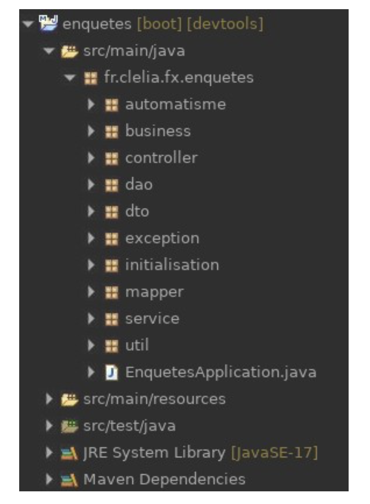
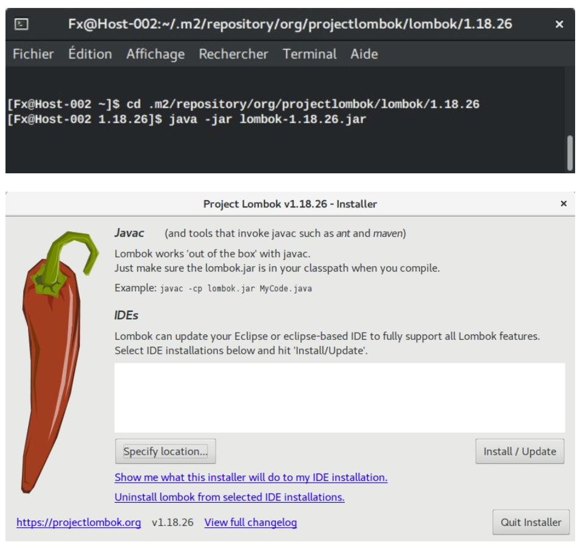

# Annexes

- Pour obtenir un script de création et ou de suppression des tables en base, les deux lignes suivantes doivent être ajoutées dans le fichier `src/main/resources/application.properties` :

```java
spring.jpa.properties.javax.persistence.schema-generation.scripts.action=create
spring.jpa.properties.javax.persistence.schema-generation.scripts.create-target=src/main/ resources/script.sql
```

::: info

A noter : si ces deux lignes sont présentes dans le fichier de configuration, les ordres de création de tables ne seront plus envoyés à la base par JPA.

:::



- Pour modifier la stratégie de nommage des tables et des colonnes en base, il suffit d’ajouter la ligne suivante :

```java
spring.jpa.hibernate.naming.physical- strategy=org.hibernate.boot.model.naming.PhysicalNamingStrategyStandardImpl

```

Avec cette stratégie de nommage :

- les noms de tables auront une majuscule à chaque mot : exemple : TypeClient
- le nom des colonnes sera identique au nom des attributs de la classe : dateHeureCreation

Pour autoriser le téléversement de fichiers (dont la taille est supérieure à 1 Mo) sur le serveur, ces deux lignes sont indispensables :

```java
spring.servlet.multipart.max-file-size=8MB
spring.servlet.multipart.max-request-size=10MB
```

- Pour modifier le nombre de connexions créées entre l’application et la base (via le connection pool Hikari présent par défaut dans l’application Spring Boot), il faut écrire :

```java
spring.datasource.hikari.maximum-pool-size=15
```

Pour intégrer Spring Security au projet, ajouter la dépendance associée :
Le fichier `pom.xml` contiendra la dépendance ci-dessous :

```java
<dependency>
    <groupId>org.springframework.boot</groupId>
    <artifactId>spring-boot-starter-security</artifactId>
</dependency>
```

Dans la classe exécutable (la classe qui contient la méthode main()) ajouter un bean chargé
de chiffrer les mots de passe avec Bcrypt :

```java
@Bean
public PasswordEncoder encoder() { return new BCryptPasswordEncoder();
}
```

Un des services doit implémenter l’interface UserDetailsService :
https://docs.spring.io/spring-security/site/docs/current/api/org/springframework/security/ core/userdetails/UserDetailsService.html
Jusqu’à la version 5.6 de Spring Security, il fallait ajouter une classe de configuration héritant de WebSecurityConfigurerAdapter.
Depuis la version 5.7 de Spring Security, il n’est plus recommandé de créer une classe de configuration qui hérite de WebSecurityConfigurerAdapter : https://spring.io/blog/2022/02/21/spring-security-without-the- websecurityconfigureradapter

```java
@Configuration
@AllArgsConstructor
public class SecurityConfiguration {

private UserDetailsService userDetailsService;
private PasswordEncoder passwordEncoder;

@Bean
SecurityFilterChain filterChain(HttpSecurity http) throws Exception { http.csrf().disable()
.authenticationManager(new CustomAuthenticationManager(userDetailsService, passwordEncoder))
        .formLogin()
            // On fait référence à une URL
            .loginPage("/index")
            .loginProcessingUrl("/login")
            .defaultSuccessUrl("/enquetes")
            .failureForwardUrl("/index?notification=Email%20ou%20mot%20de
%20passe%20incorrect")
            .and()
            .logout()
            .logoutUrl("/deconnexion")
            .logoutSuccessUrl("/index?notification=Au%20revoir")
            .and()
            .authorizeRequests()
            .antMatchers("/h2-console").permitAll()
            .antMatchers("/enquetes").authenticated()
            .antMatchers("/enquete").authenticated()
            .antMatchers("/questions").authenticated()
            .antMatchers("/question").authenticated()
// Pour la console H2 (à ne pas utiliser en prod) .and()
            .headers().frameOptions().disable();
            return http.build(); }
}
```

Le formulaire de connexion doit impérativement contenir un champ de saisie dont le nom est `username` et un champ de saisie dont le nom est `password` :

```java
<form action="login" method="post">
<input type="email" name="username" placeHolder="Email" required><br> <input type="password" name="password" placeHolder="Mot de Passe"
required><br>
<input type="submit" value="Connexion">
</form>
```

- Pour que Spring lance des tâches programmées, la classe contenant la méthode main doit être annotée `@EnableScheduling`. Chaque méthode que Spring doit invoquer automatiquement doit être annotée`@Scheduled`

- Pour modifier le port sur lequel le serveur Tomcat écoute :
  `server.port=8280`

- Pour intégrer Lombok dans l’IDE. Quitter l’IDE puis exécuter le jar de lombok disponible dans .m2/repository/org/projectlombok/lombok/1.18.28/ : java -jar lombok-1.18.28.jar



Si Lombok ne détecte pas l’IDE. Relancer l’IDE. Le chemin où Eclipse est installé est précisé sur l’onglet Configuration de la modale : Help / About Eclipse / Installation Details.

- Définition de deux profiles dans le fichier `src/main/resources/application.properties`:

```java
spring.profiles.active=dev
#---
spring.config.activate.on-profile=dev logging.level.root=INFO logging.level.org.springframework=DEBUG
logging.file.name=log/enquetes_dev_log logging.pattern.console= %d %p %c{1.} [%t] %m%n
#---
spring.config.activate.on-profile=prod logging.level.root=WARN logging.level.org.springframework=WARN logging.file.name=log/enquetes_prod_log logging.pattern.console= %d %p %c{1.} [%t] %m%n
```

- Exemple de fichier application.properties utilisant une source de données MySQL :
  `server.port=8280`

```java
spring.datasource.url=jdbc:mysql://localhost:3306/enquetes?useSSL=false spring.datasource.username=root
spring.datasource.password= spring.datasource.driver-class-name=com.mysql.cj.jdbc.Driver
spring.jpa.show-sql=true
spring.jpa.properties.hibernate.format_sql=true spring.jpa.properties.hibernate.generate_statistics=true spring.jpa.properties.hibernate.dialect=org.hibernate.dialect.MySQL8Dialect spring.jpa.hibernate.ddl-auto=update
spring.jpa.generate-ddl=true
spring.h2.console.enabled=true
spring.mvc.view.suffix=.jsp spring.mvc.view.prefix=/WEB-INF/
logging.level.root=WARN logging.level.org.springframework=WARN logging.file.name=log/enquetes_log logging.pattern.console= %d %p %c{1.} [%t] %m%n
spring.data.rest.detection-strategy=annotated spring.data.rest.base-path=/api-autogeneree/
management.endpoint.info.enabled=true management.endpoints.web.base-path=/ management.endpoints.web.exposure.include=beans
server.error.path=/erreur
spring.servlet.multipart.max-file-size=8MB spring.servlet.multipart.max-request-size=10MB
```

- Version de dépendances utilisées par Spring Boot 2.7.13 sortie le 22/06/2023 :
  https://spring.io/blog/2023/06/22/spring-boot-2-7-13-available-now
  Spring Framework : 5.3.28 Hibernate : 5.6.15 Hibernate Validator : 6.2.5 Spring Security : 5.7.9 Log4J : 2.17.2
  Tomcat : 9.0.76 Jackson : 2.13.5 Lombok : 1.18.28 H2 : 2.1.214 Mockito : 4.5.1 JUnit : 5.8.2
  Source : https://github.com/spring-projects/spring-boot/releases/tag/v2.7.13
