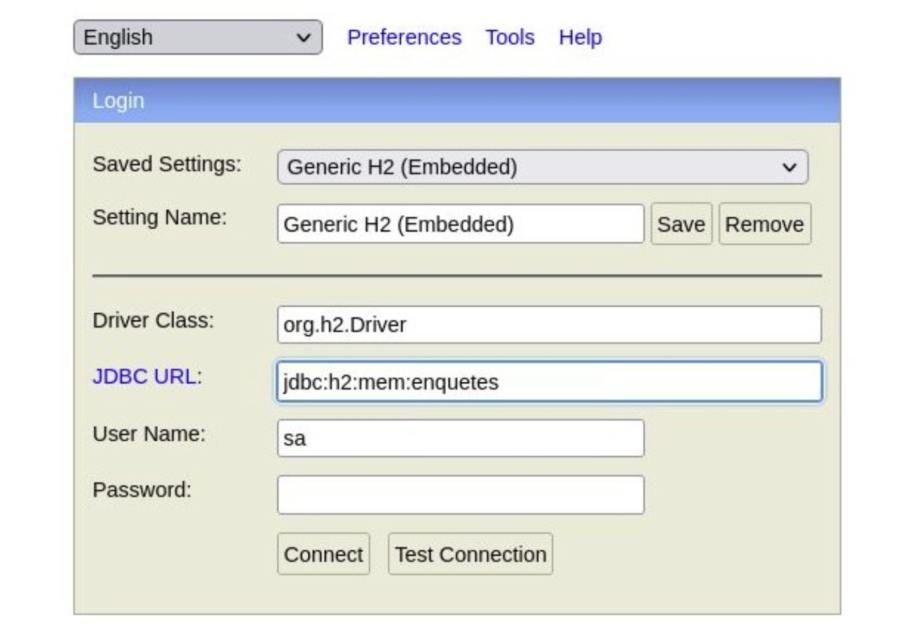

# Application.properties

1. Décompresser le fichier zip dans le workspace d’Eclipse

2. Dans Eclipse, importer le projet Maven en utilisant l’assistant : File / Import / Existing Maven projects. Dans IntelliJ ouvrer le projet Maven. En cas d’erreur dans IntelliJ supprimer le dossier `.idea` et ouvrir de nouveau le projet.

3. Ajouter dans le fichier `pom.xml`, au niveau de la balise dependencies, les deux balises suivantes :

```xml
<dependency>
    <groupId>org.apache.tomcat.embed</groupId>
    <artifactId>tomcat-embed-jasper</artifactId>
</dependency>
<dependency>
    <groupId>javax.servlet</groupId>
    <artifactId>jstl</artifactId>
</dependency>
```

La première balise incorpore Jasper au projet. Jasper convertit les JSPs en servlets.
La seconde balise intègre la bibilothèque balises JSTL. Ce faisant les JSPs auront accès à toutes les balises de cette bibliothèque (if, when, choose, forEach, etc).

4. Ajouter dans le fichier `src/main/resources/application.properties` les lignes suivantes :

```
spring.jpa.show-sql=true
spring.jpa.generate-ddl=true
spring.jpa.hibernate.ddl-auto=update
spring.mvc.view.suffix=.jsp
spring.mvc.view.prefix=/WEB-INF/
```

::: info

A noter : les autres valeurs de ddl-auto sont : `none`, `validate` , `create`, et `create-drop`. Avec la dernière valeur, Hibernate essaie de supprimer toutes les tables avant de les créer ce qui se révèle très utile en phase de développement.

:::

4.1 Pour une base H2 en mémoire, le fichier de configuration doit également inclure :

```
spring.datasource.url=jdbc:h2:mem:enquetes
spring.datasource.driver-class-name=org.h2.Driver
spring.jpa.properties.hibernate.dialect=org.hibernate.dialect.H2Dialect
```

Si une base H2 est utilisée en production, vérifier :

- que la balise <scope>test</scope> n’est pas présente dans la dépendance vers H2 du
  fichier `pom.xml`.
- que la propriété `spring.h2.console.enabled` est bien définie à vrai :

```
spring.h2.console.enabled=true

```

Ce faisant, la console H2 sera accessible à cette URL : http://localhost:8080/h2-console



Par défaut le champ User Name est sa. Le champ Password peut être laissé vide.

4.2 Pour une base H2 stockée sur le disque dur, le fichier de configuration doit également
inclure :

```
spring.datasource.url=jdbc:h2:~/enquetes
spring.datasource.driver-class-name=org.h2.Driver
spring.jpa.properties.hibernate.dialect=org.hibernate.dialect.H2Dialect
```

::: code-group

```[PostgreSQL]
spring.datasource.url=jdbc:postgresql://localhost:5432/enquetes
spring.datasource.username=postgres
spring.datasource.driver-class-name=org.postgresql.Driver
spring.jpa.properties.hibernate.dialect=org.hibernate.dialect.PostgreSQL10D
ialect
```

```[MySQL]
spring.datasource.url=jdbc:mysql://localhost:3306/enquetes?useSSL=false
spring.datasource.username=root
spring.datasource.password=spring.datasource.driver-class-name=com.mysql.cj.jdbc.Driver
spring.jpa.properties.hibernate.dialect=org.hibernate.dialect.MySQL8Dialect
```

:::

4.5 Pour exposer les beans présents dans le conteneur de Spring (grâce à Actuator) :

```
management.endpoint.info.enabled=true
management.endpoints.web.base-path=/
management.endpoints.web.exposure.include=beans
```

Ce faisant la liste des beans contenus dans le conteneur de Spring sera accessible par l'URL
http://localhost:8080/beans

4.6 Pour demander à Spring la gestion d’un fichier de journalisation :

```
logging.level.root=WARN
logging.level.org.springframework=WARN
logging.file.name=log/enquetes_log
logging.pattern.console= %d %p %c{1.} [%t] %m%n
```

::: tip

Les niveaux de log sont : `FATAL`, `ERROR`, `WARN`, `INFO`, `DEBUG`, `TRACE`

Lien vers la document de Log4J concernant les patterns :

:::

https://logging.apache.org/log4j/2.x/manual/layouts.html
Par défaut Spring crée un nouveau fichier pour chaque jour ou dès que le fichier actuel de log atteint 10.5 Mo.

Exemple d’entrée dans le fichier de journalisation :

```
2022-01-07 08:32:18.382 WARN 12698 --- [restartedMain] JpaBaseConfiguration$JpaWebConfiguration : spring.jpa.open-in-view is enabled by default. Therefore, database queries may be performed during view rendering. Explicitly configure spring.jpa.open-in-view to disable this warning

```

:::info

Se référer à la documentation officielle pour bien comprendre comment modifier le fichier application.properties : https://docs.spring.io/spring-boot/docs/current/reference/html/application-properties.html

:::
