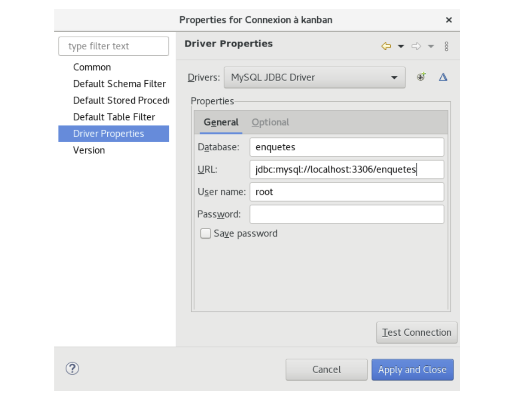
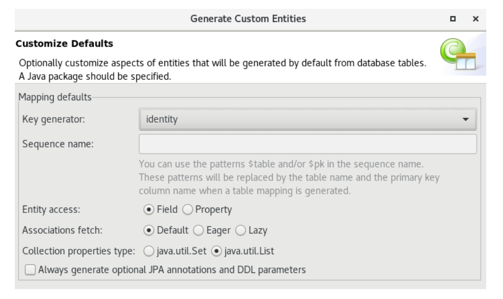

# Classes business

Pour chaque classe métier:

- Ajouter un constructeur vide, sinon on obtient l’exception :
  `org.hibernate.InstantiationException: No default constructor for entity: fr.clelia.fx.enquetes.business.Enquete`

- Ajouter un accesseur (méthode get) et un mutateur (méthode set) pour chaque attribut privé

- Une méthode `toString()`: Spring va se servir de cette méthode pour générer les formulaires HTML utilisant les balises `<form:form>` et donner à chaque élément du formulaire la bonne valeur par défaut

- Annoter les classes business avec les annotations Hibernate (se référer au [mémento Annotations](/annotations/introduction.md)) Exemple:

::: code-group

```java [sans-lombok]
@Entity
public class Question {

@Id
@GeneratedValue(strategy=GenerationType.IDENTITY)
private int id;

private String libelle; @ManyToOne

private Enquete enquete;

public Question() {

 }
 ...
}
```

```java [lombok]
@Entity // [!code focus]
@NoArgsConstructor // [!code focus]
@Getter // [!code focus]
@Setter // [!code focus]
@EqualsAndHashCode // [!code focus]
@ToString // [!code focus]
public class Question {
@Id
@GeneratedValue(strategy=GenerationType.IDENTITY)
private int id;

private String libelle;

@ManyToOne
private Enquete enquete;
...
}

```

::: code-group

_**Version Database First**_:

- Concevoir les tables avec MySQL Workbench, JMerise ou looping
- Ajouter une connexion à la base de données



- Cliquer-droit sur le projet: configure / convert to JPA project
- JPA est coché, cliquer sur Next
- Choisir Generic 2.1 et disable user library puis cliquer sur Finish
- Cliquer droit sur le projet JPA Tools / Generate Entities from Tables
- Sélectionner toutes les tables, cliquer sur Next 2 fois
- Sur la fenêtre « Customize Defaults » chosir identity comme Key generator et comme package le dossier business



Alternativement, les classes métier peuvent être générées en choisissant File / New / JPA Entities from Tables

- Générer le diagramme de classes métier avec le reverse engineer de StarUML et placer le fichier .mdj ainsi qu’une version PNG du diagramme dans un dossier nommé `doc`
