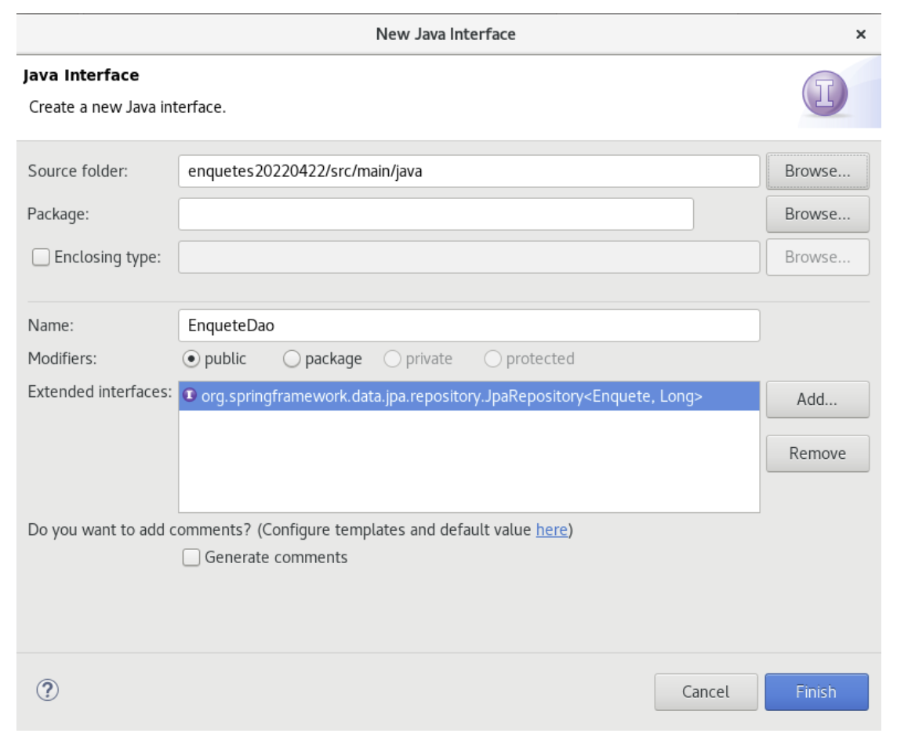
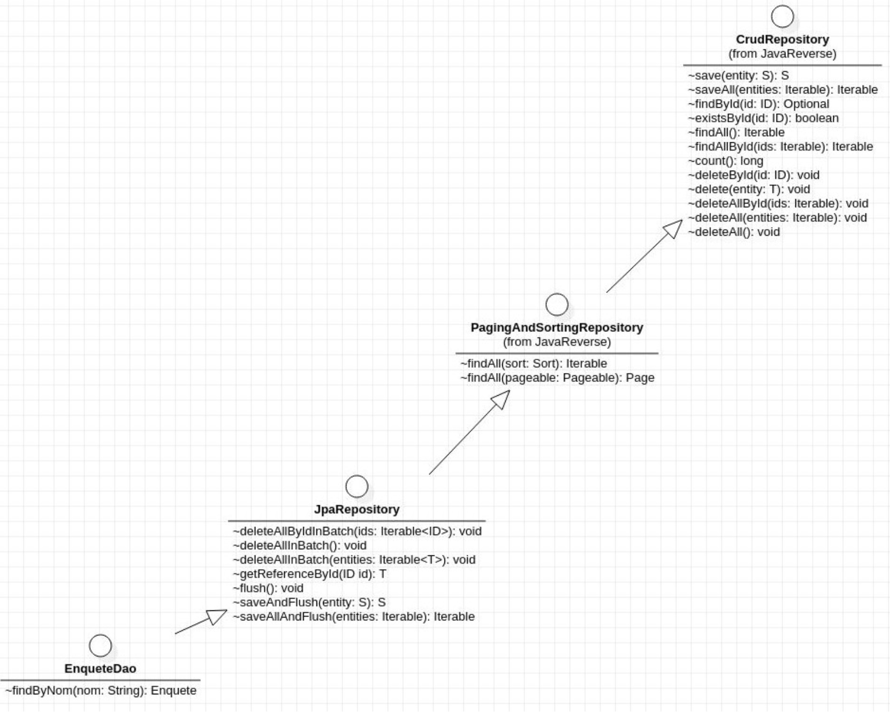

# Dao

- Écrire les interfaces DAO en sélectionnant dans le menu File / New / Interface. Chaque interface hérite de JpaRepository



```java
public interface EnqueteDao extends JpaRepository<Enquete, Long> {}
```

- Avec IntelliJ et le plugin JPA Buddy (https://www.jpa-buddy.com/ disponible sur le marketplace d’IntelliJ à partir de la version 2020), les DAO peuvent être générées en choisissant une ou plusieurs classes puis new Spring Data Repository.

Javadoc des interfaces Repository de Spring Data JPA :
https://docs.spring.io/spring-data/jpa/docs/current/api/org/springframework/data/jpa/ repository/JpaRepository.html

- L’interface JpaRepository hérite de l’interface PagingAndSortingRepository :
  https://docs.spring.io/spring-data/commons/docs/current/api/org/springframework/data/ repository/PagingAndSortingRepository.html

- L’interface PagingAndSortingRepository hérite de l’interface CrudRepository :
  https://docs.spring.io/spring-data/commons/docs/current/api/org/springframework/data/ repository/CrudRepository.html

  Voici un diagramme de classes présentant l’héritage entre les 4 interfaces :

  

- Dans chaque interface du package dao, des méthodes annotées `@Query` ou des méthodes requêtes peuvent être déclarées. Par défaut l’annotation `@Query` attend une requête HQL :

```java
@Query("FROM Theme t ORDER BY size(t.enquetes) DESC") List<Theme> findThemesSortedByNbEnquetes();
```

Se référer à la documentation officielle pour rédiger la requête HQL :
https://docs.jboss.org/hibernate/stable/orm/userguide/html_single/ Hibernate_User_Guide.html

- L’annotation `@Query` peut aussi accueillir une requête SQL grâce à l’attribut `nativeQuery` :

```java
@Query(value="SELECT * FROM Enquete WHERE theme_id=:idTheme", nativeQuery=true)
List<Enquete> findByIdTheme(@Param("idTheme") Long idTheme);
```

- Une alternative à l’annotation `@Query` est l’écriture de requête par dérivation, en anglais « query-method ». Le nom de la méthode est interprété par Spring Data et traduit en HQL. Exemple :

```java
List<Enquete> findByTheme(Theme theme);
```

- Les mots clés autorisés dans le nom des méthodes sont résumés sur la table suivante :
  https://docs.spring.io/spring-data/jpa/docs/current/reference/html/#jpa.query- methods.query-creation
