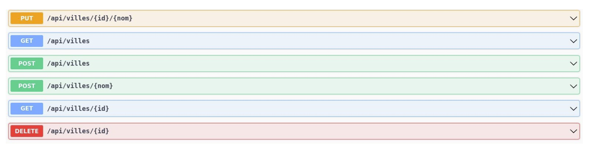

# Documentation API

Générer la documentation de l’API et la page Swagger-UI

https://swagger.io/tools/swagger-ui/

Ajouter dans le fichier `pom.xml`, au niveau de la balise dependencies, la balise suivante :

```java
<dependency>
    <groupId>org.springdoc</groupId>
    <artifactId>springdoc-openapi-ui</artifactId>
    <version>1.7.0</version>
</dependency>
```

Redémarrer l’application Spring Boot manuellement. La documentation Swagger est désormais accessible à partir de l’URL suivante : http://localhost:8080/swagger-ui/index.html

Cette page présente les ressources de l’API de manière très lisible :



La documentation OpenAPI (au format JSON) est disponible à l’adresse suivante : http://localhost:8080/v3/api-docs

- Confier la génération de la Javadoc et des informations sur le projet Maven en ajoutant dans le fichier pom.xml la balise reporting :

```java
<reporting>
    <plugins>
        <plugin>
            <groupId>org.apache.maven.plugins</groupId>
            <artifactId>maven-project-info-reports-plugin</artifactId>
            <version>2.6</version>
        </plugin>
        <plugin>
            <groupId>org.apache.maven.plugins</groupId>
            <artifactId>maven-javadoc-plugin</artifactId>
            <version>3.3.2</version>
        </plugin>
    </plugins>
        <outputDirectory>doc</outputDirectory>
</reporting>
```

Puis lancer maven site.

- Lancer l’application avec le goal Maven : `.mvnw spring-boot:run`
