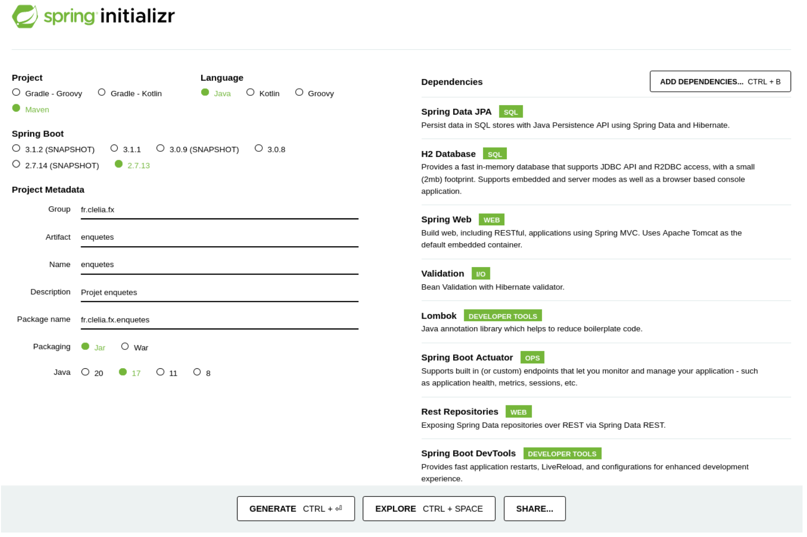

# Spring Initializer

Générer le projet Maven à l’aide de Spring Initializr : https://start.spring.io

:::info

NB : Huit dépendances ont été ajoutées. Ce site évolue aussi vite que Spring Boot :
https://github.com/spring-projects/spring-boot/milestones

:::

En sélectionnant Maven, le nouveau projet aura pour parent le projet `spring-boot-starter- parent`. La version de chaque dépendance (du projet parent) est précisée sur cette page : https://docs.spring.io/spring-boot/docs/current/reference/html/dependency-versions.html
Alternativement, pour générer le projet Maven :

- avec Eclipse et le plugin Spring Tool Suite : File / New / Spring Boot / Spring Starter Project - avec IntelliJ et les plugins Spring et Spring Boot : File / New / Project / Spring Initializr

Si le projet utilise une base de données, un driver JDBC adéquat est requis (sur la capture de la deuxième page, il s’agit de H2 Driver).
Pour que l’application embarque un serveur Tomcat, la dépendance Spring Web sera ajoutée.
Si vous souhaitez que l’application redémarre dès qu’elle détecte un changement dans les fichiers du projet, la dépendance `Spring Boot DevTools` est faite pour vous. Pour assurer le bon fonctionnement de Spring Boot DevTools dans IntelliJ, vérifiez que les deux options suivantes sont cochées :

- Dans Build, Execution, Deployment | Compiler : `“Build project automatically”`

- Dans Advanced Settings | Compiler : `“Allow auto-make to start even if developed application is currently running”`.
  Afin d’obtenir des classes persistantes, autrement dit annotées avec `@Entity` de JPA (Jakarta Persistance API : https://jakarta.ee/specifications/persistence/2.2/), il faut ajouter la dépendance Spring Data JPA.

  Les annotations de validation (`@NotNull`, `@NotBlank`, `@Size`) sont regroupées dans la dépendance `“Validation”` liée à la spécification de Jakarta https://jakarta.ee/specifications/bean-validation/
